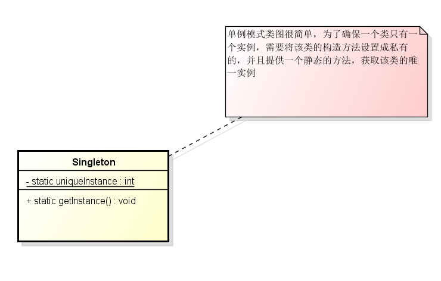
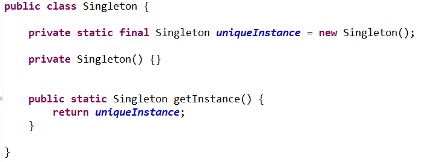
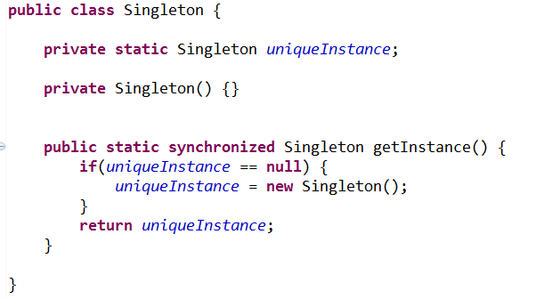
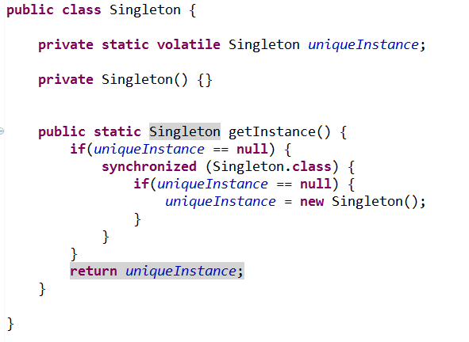
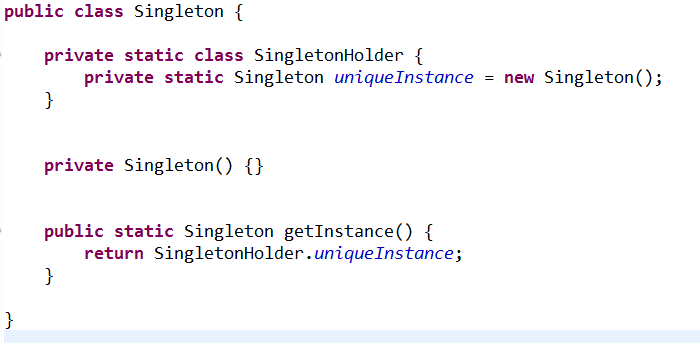
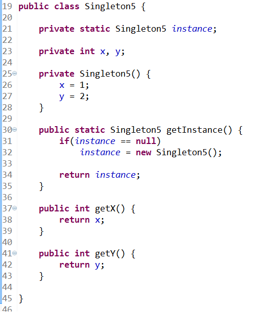

# 创建型-单例模式

**单例模式定义：**  
确保一个类只有一个实例，并提供一个全局访问点

**单例模式结构图：**

### 单例模式的几种实现形式
#### 方式一
采用静态变量直接初始化，简单有效，在该类第一次被虚拟机加载的时候回实例化变量实例，不适用大对象

#### 方式二
延迟实例化，直接在方法上同步，弊端是每次获取实例对象时都需要加锁，不推荐使用，在高并发的情况下很影响性能

#### 方式三
双重检查加锁（DCL），减少加锁的次数，并且实现了延迟初始化（DCL已经不被推荐使用）
如果要确保正确下，这里的 volatile 是必须的，并且需要是 jdk1.5 之后的版本（jdk1.5才对 volatile 的 happen-before 进行修复）

> PS：  
DCL 获取到同一单个实例这个逻辑没问题题，但是最大的问题是可能获取到不正确的对象引用（未初始化完成的对象引用），这是可能因为指令重排，或者 cpu cache 导致  
关于 DCL 的更多说明可以参考，这篇文章在末尾的地方说明了 DCL 存在的问题
[参考文章](https://www.cs.umd.edu/~pugh/java/memoryModel/jsr-133-faq.html
)

#### 方式四
推荐这种方式，既实现了延迟初始化，又由JVM保证了单例

---------------

分析下下面这个示例的问题

没有使用任何的同步来不安全地发布一个对象

对于这个类最糟糕的情况不是创建了多个实例，而是可能会导致其他线程看到没有构造完成的对象，即可能会导致有些线程拿到的 instance 对象里面的 x,y 都等于0，或者 x=1, y=0；或者 y=2,x=0 都有可能
导致这种情况的原因是因为指令重排，在构造函数中对 x=1, y=2 的赋值指令，以及将 new Singleton5() 对象赋值给 instance 属性的指令可能发生重排序，所以可能会导致线程A在构造对象时，线程B已经看到对象的引用(instance 属性)已经被赋值，但是x,y的赋值指令可能还没有刷回主存，B获取到了一个构造不完全的对象

**除了不可变对象外，使用被另一个线程初始化的对象通常都是不安全的，除非对象的发布操作是在使用该对象的线程开始使用之前执行。**
