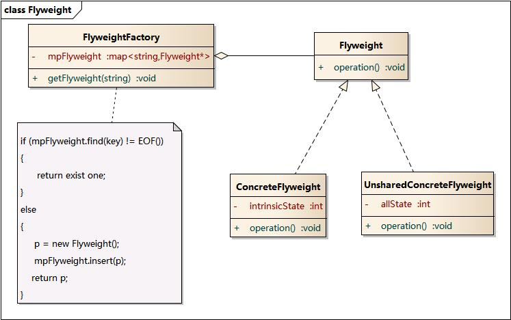

# 结构型-享元模式(Flyweight Pattern)

**模式定义：**  
运用共享技术有效地支持大量细粒度对象的复用。系统只使用少量的对象，而这些对象都很相似，状态变化很小，可以实现对象的多次复用。由于享元模式要求能够共享的对象必须是细粒度对象，因此它又称为轻量级模式，它是一种对象结构型模式。

**享元模式类图：**

享元模式包含如下角色
- Flyweight: 抽象享元类
- ConcreteFlyweight: 具体享元类（小的对象）
- UnsharedConcreteFlyweight: 非共享具体享元类
- FlyweightFactory: 享元工厂类

### 模式总结
- 享元模式可以用来解决那些需要大量创建的小对象，而且这些对象大部分属性/状态相同，小部分外部状态不同，可以通过参数传入的形式来修改
- 享元模式的目的就是使用共享技术来实现大量细粒度对象的复用
- 享元模式的核心在于享元工厂类，享元工厂类的作用在于提供一个用于存储享元对象的享元池，用户需要对象时，首先从享元池中获取，如果享元池中不存在，则创建一个新的享元对象返回给用户，并在享元池中保存该新增对象
