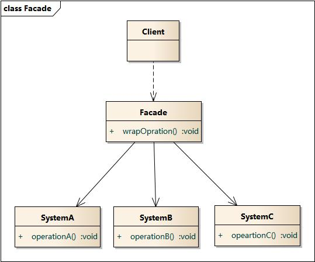

# 结构型-外观模式

**定义：**  
提供一个统一的接口，用来访问子系统的一群接口。外观定义了个更高层次的接口，让子系统更容易使用。

外观模式使用前和使用后

**外观模式类图**

外观模式包含如下角色：
- Facade: 外观角色
- SubSystem：子系统角色

### 外观模式总结
- 也称 Facade 模式/门面模式
- 外观模式通常可以和单例模式结合起来，一个业务功能的 Facade 通常只需要一个实例对象
- 不应该通过外观类来为子系统增加新的行为，子系统新的行为增加应该通过扩展子类来实现，外观类只是用来提供一个集中化简约的访问入口
- 外观模式时符合“最少知识原则”
- 外观模式的缺点在于违背了“开闭原则”，当增加新的子系统或者移除子系统时需要修改外观类
