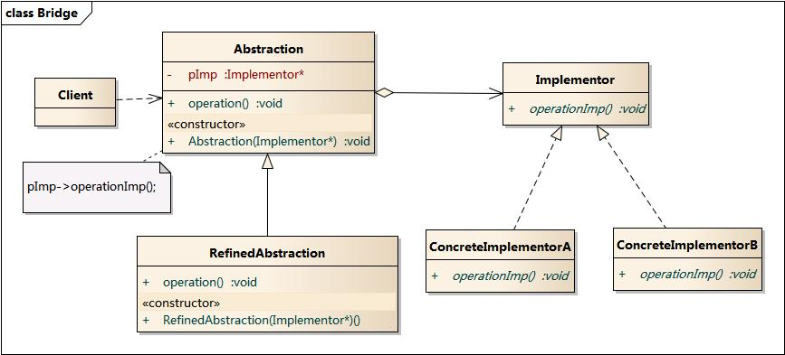
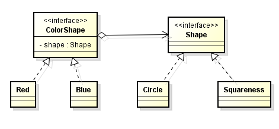

# 结构型-桥接模式

**定义：**  
将抽象部分与它的实现部分分离，使它们都可以独立地变化。

**类图：**



桥接模式包含如下角色：
- Abstraction：抽象类
- RefinedAbstraction：扩充抽象类
- Implementor：实现类接口
- ConcreteImplementor：具体实现类


### 示例
设想如果要绘制矩形、圆形、椭圆、正方形，我们至少需要4个形状类，但是如果绘制的图形需要具有不同的颜色，如红色、绿色、蓝色等，此时至少有如下两种设计方案：

- 第一种设计方案是为每一种形状都提供一套各种颜色的版本。
- 第二种设计方案是根据实际需要对形状和颜色进行组合

对于有两个变化维度（即两个变化的原因）的系统，采用方案二来进行设计系统中类的个数更少，且系统扩展更为方便。设计方案二即是桥接模式的应用。桥接模式将继承关系转换为关联关系，从而降低了类与类之间的耦合，减少了代码编写量。

大概的解决方案：


客户端调用
``` java
// 得到一个红色的圆形
ColorShape cs = new Red(new Circle());
```

### 桥接模式与装饰者模式的区别

桥接模式的定义是将抽象化与实现化分离（用组合的方式而不是继承的方式），使得两者可以独立变化。可以减少派生类的增长。这样看起来和装饰者差不多，但两者还是有一些比较重要的区别：

- 桥接模式中所说的分离，其实是指将结构与实现分离（当结构和实现有可能发生变化时）或属性与基于属性的行为进行分离；而装饰者只是对基于属性的行为进行封闭成独立的类。
- 桥接中的行为是横向的行为，行为彼此之间无关联；而装饰者模式中的行为具有可叠加性，其表现出来的结果是一个整体，一个各个行为组合后的一个结果。


自己总结：  
桥接模式和装饰者模式都是用来封装两个或多个维度的变化，并且将多个拆分后的维度进行自由组合

参考：  
[桥接模式](http://design-patterns.readthedocs.io/zh_CN/latest/structural_patterns/bridge.html)  
[桥接模式与装饰者模式的区别](http://blog.csdn.net/wzg1031/article/details/7796806)
