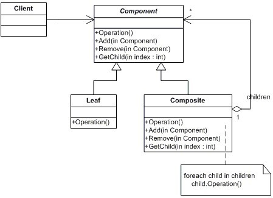
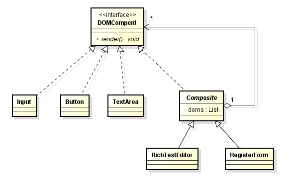

# 结构型-组合模式

**定义：**  
将对象组合成树形结构以表示“部分整体”的层次结构。组合模式使得用户对单个对象和使用具有一致性。

**类图：**

### 示例
假设我们需要实现一个可以自定义的 HTML 表单系统，我们知道一个 HTML 的表单会包含很多 DOM 元素，例如文本框，按钮，textarea 等简单元素，但是也可能包含其他复杂的 DOM 元素，例如富文本编辑器（由 textarea 和 一堆按钮组成），然后表单里面可能还包含其他的子表单等等

对于这一类的问题——富文本编辑器本身是 DOM 元素，但是其本身又是有其他 DOM 元素组成，就非常适合使用组合模式来解决

