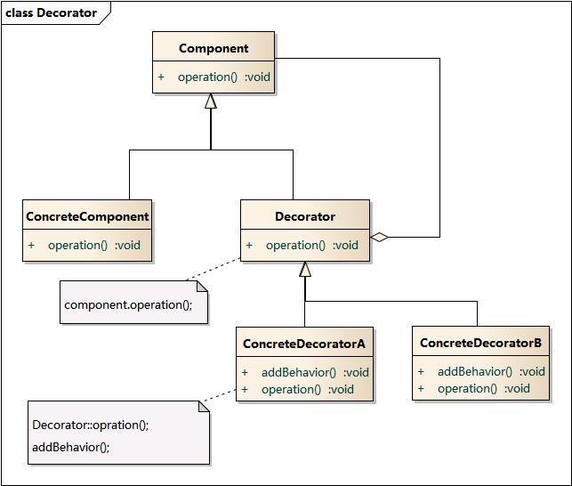
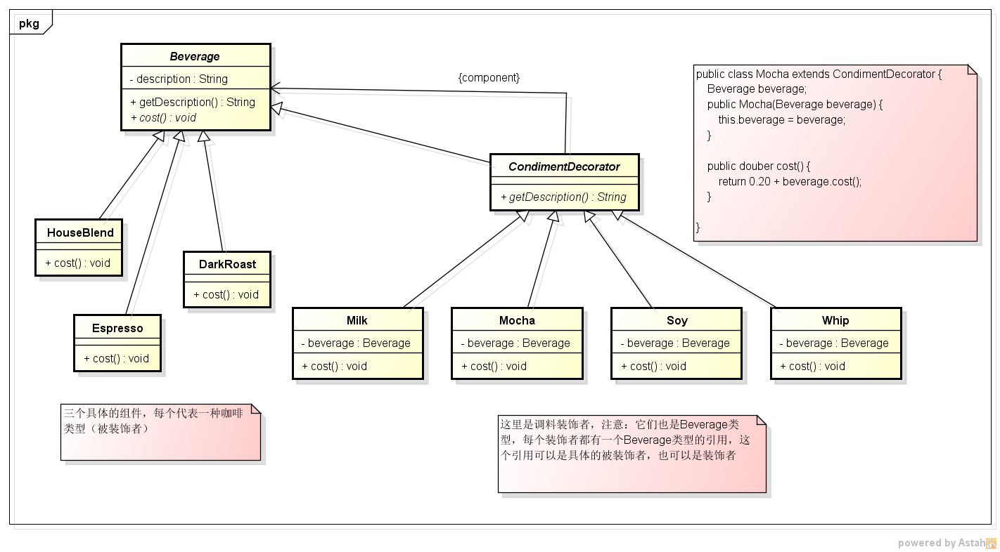

# 结构型-装饰者模式


**定义：**  
动态地将责任附加到对象上。若要扩展功能，装饰者提供了比继承更有弹性的替代方案。装饰者可以在所委托被装饰者的行为之前与/或之后，加上自己的行为，以达到特定的目的。


**类图：**  




### 示例
考虑如下咖啡店的实现，咖啡店会经营很多种类的咖啡类型，例如有：星巴克咖啡，焦炒咖啡，速溶咖啡等，然后针对每一种的咖啡实现又可以加糖，加奶油，加牛奶，加摩卡等等，现在我们需要为每种类型的咖啡计算销售价格

使用装饰者模式的解决方案：  
我们首先对咖啡定义一个抽象 `Beverage` ，每种具体的咖啡实现（星巴克咖啡，焦炒咖啡，速溶咖啡等）继承该抽象，然后将加糖，加奶油，加牛奶，加摩卡这些实现为调料装饰者，得到如下类结构图



客户端使用
``` java
// 加奶星巴克咖啡
Beverage coffe = new Milk(new HouseBlend());
coffe.cost();

// 加摩卡加奶焦炒咖啡
Beverage coffe = new Mocha(new Milk(new DarkRoast()));
```

PS：如果此时我们还要继续实现大杯，中杯，小杯类型的咖啡时，我们可以再扩展一个装饰者类，最终可能就会得到如下代码

``` java
// 大杯加奶星巴克咖啡
Beverage coffe = new BigCup(new Milk(new HouseBlend()));
```

### 示例II
现在有一个数据库访问组件DbOperator，他可以对数据库进行访问，现在需要增加一个Cache功能，对一个查询， 如果可以命中缓存，就不需要去数据库再查询。接着要又要增加一个安全检查功能，对于一些操作，如更新，进行预先检查。


### jdk 中的应用

jdk 实现流的实现就是典型的装饰者模式的实现 `InputStream is = new BufferedInputStream(new FileInputStream(file))`
