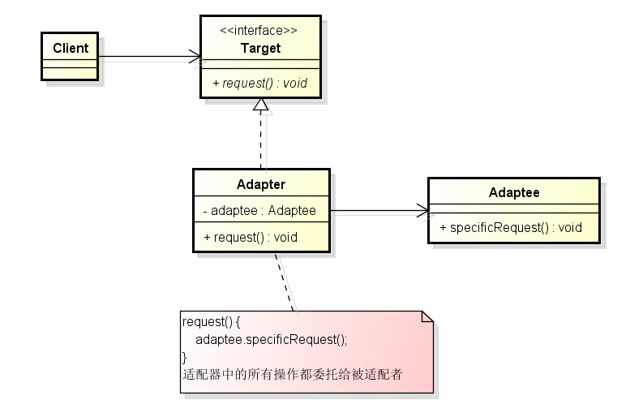

# 结构型-适配器模式

**定义：**  
将一个类的接口，转换成客户期望的另一个接口。适配器让原本接口不兼容的类可以合作无间。

**适配器模式类图**

**类适配器和对象适配器**
- 类适配器：多重继承（`Adapter` 既继承 `Target` 又继承 `Adaptee`，并且将 `Adapter` 的接口实现委托给 `Adaptee` ；java不具备）
- 对象适配器：使用组合的方式来替代多重继承（上图就是对象适配器）

**适配器模式和装饰者模式对比**
- 都是通过对象的组合来使类具有一些特殊功能

**区别：**
- 适配器，主要是进行接口的转换，适配器类自己不会去实现真正的逻辑（当然有些重名的适配器可能会这么做），真正的逻辑是委托给被适配者。
- 装饰者，主要是扩展被包装对象的行为或者职责，并不是“简单传送”，当事情涉及到装饰者模式时，就表示有一些新的行为或责任需要加入到你的设计中。
