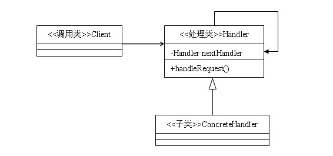
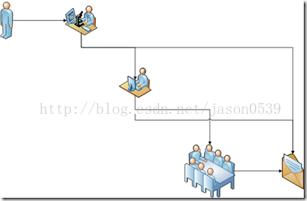
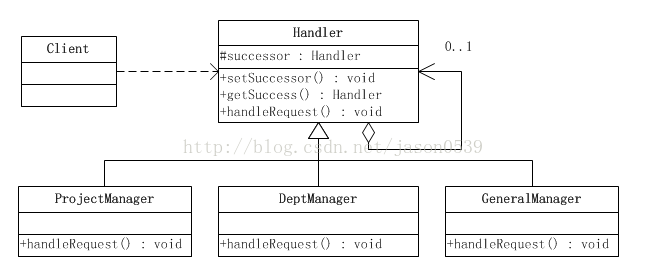
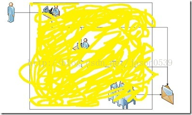

# 行为型-责任链模式

**定义：**  
使多个对象都有机会处理请求，从而避免了请求的发送者和接收者之间的耦合关系。将这些对象连成一条链，并沿着这条链传递该请求，直到有对象处理它为止。

**类结构图：**

**说明：**
- `Handler` 所有请求处理类的抽象接口，这里面最主要的方法就是 `#handleRequest`，负责具体的请求处理
- `Handler` 还有一个重要的属性就是 `nextHanler`，用来保存下一个具体的处理器，每个 `Handler` 持有自己的下一个 `Handler`，这样循环下去就构成了一个请求处理的链（`HandlerChain`）
- `ConcreteHandler` 具体的请求处理实现类，这里的处理逻辑一般先判断当前实现类是否可以处理该请求，如果可以那么走具体的请求处理逻辑，否则将请求交给 `nextHanler` 处理
- 通常情况下每个 `Handler` 的职责都是单一的，只负责处理某一类特定的请求，所以 `ConcreteHandler` 一般都会需要判断下当前客户端的请求自己是否可以处理，更通常一点的做法是在 `Handler` 接口中在抽取一个 `#canHandler : boolean` 方法来返回当前 `Handler` 可以处理某个类型的请求

### 示例：请假审批流程
不同级别的领导，对于审批的额度是不一样的，比如，项目经理只能审批500元以内的申请；部门经理能审批1000元以内的申请；而总经理可以审核任意额度的申请。

使用责任链模式的实现

使用责任链模式的实现的好处就是对于客户端来说，并不需要关心最终的请求是由谁来处理

### 责任链模式的变体

其他框架中典型责任链模式的实现
- servlet 中的 Filter 模式 ( FilterChain )
- dubbo 中的 Filter
- mybatis 中的 Plugin
